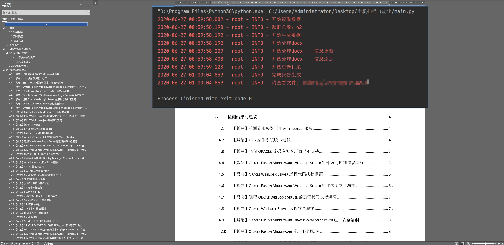

# NessusToReport
这是一个nessus自动报告生成工具，可以用来自动生成nessus扫描器的中文报告--NessusToReport,

GitHub:`https://github.com/Hypdncy/NessusToReport`

*版权所有，侵权必究*

*本项目，仅仅代表个人，如有侵权，请联系我删除*

## 原理说明

1. 程序将会自动扫描nessus目录下的csv文件，将他们读取
1. 程序将只保留csv中的紧急,高危,中危漏洞，并且与数据库，自定义配置漏洞信息做匹配
    1. 匹配成功部分将会读取数据库中的漏洞信息，写入到loops.json中
    1. 匹配失败部分将会写入到errors.json中
        1. 若开启翻译，程序将会联网翻译该漏洞信息，并且再次写入到loops.json中
        1. 未开启翻译，程序将会抛出`漏洞PluginId`异常终止
1. 程序将自动将自动根据模板生成docx文档

## 安装说明

建议在windows下安装python3版本

```shell script
root@hypdncy:~# pip install -r requirement.txt
```

## 配置说明

#### 基本配置

##### 配置时间信息

1. 配置位置：cnf/default.py中`def_default.data`参数
1. 配置默认：默认配置为当天的时间
1. 配置方法：按照参数栗子进行配置
1. 配置说明：该配置将会替换文档中的时间相关信息

##### 修改人员信息

1. 配置位置：cnf/default.py中`def_default.monitor`,`def_default.manager`,`def_default.work`参数
1. 配置方法：按照参数栗子进行配置
1. 配置说明：该配置将会替换文档中的参与人员信息

##### 配置客户信息

1. 配置位置：config.py中`config.user`参数
1. 配置方法：按照参数栗子进行配置
1. 配置说明：该配置将会替换文档中的客户相关信息

##### 配置系统信息

1. 配置位置：config.py中`config.systems`参数
1. 配置方法：按照参数栗子进行配置
1. 配置说明：该配置将会替换文档中的`实施范围`表

#### 漏洞配置

##### 配置自定义漏洞信息

1. 配置位置：config.py中`config.nessus_vuln_self`参数
1. 配置方法：按照参数栗子进行配置
1. 配置说明：该配置将会覆盖数据库中的漏洞信息，主要用于防止因为`漏洞PluginId`异常发生报错

##### 配置自定义漏洞等级

1. 配置位置：config.py中`config.nessus_risk_self`参数
1. 配置方法：按照参数栗子进行配置
1. 配置说明：该配置将会覆盖数据库中的漏洞等级，主要用于解决`JavaScript`,`PHP`等版本漏洞风险等级过高

##### 配置自定义漏洞忽略

1. 配置位置：config.py中`config.nessus_ignore_ids`参数
1. 配置方法：按照参数栗子进行配置
1. 配置说明：该配置将会忽略`nessus_ignore_ids`所对应的漏洞，把他们排除在外

#### 翻译配置

##### 配置翻译功能

1. 配置位置：config.py中`config.translate_status`参数
1. 配置方法：按照参数栗子进行配置
1. 配置说明：该配置开启后将会自动翻译数据库中不存在的漏洞信息，并且防止因为`漏洞PluginId`异常发生报错

##### 配置翻译接口

1. 配置位置：config.py中`config.translate_api`,`config.translate_url`,`config.translate_appid`,`config.translate_secret`,参数
1. 配置方法：按照参数栗子进行配置
1. 配置说明：该配置会决定使用的翻译API

## 使用说明

1. 导入nessus的csv，放置到csv/nessus/目录下
1. 更新属于自己的模板文档并放置在template目录下
1. 配置如上的信息
1. 执行命令

```shell script
root@hypdncy:~# python main.py -t host # 指定扫描报告类型
root@hypdncy:~# python main.py # 默认主机扫描报告
```

## 技巧说明

1. 建议使用windows+python3
1. 遇到数据库中不存在的漏洞信息时：
    1. 使用`配置自定义漏洞信息`功能，重新生成报告
        1. 读取errors.json中的文件
        1. 人工翻译并把它粘贴到`config.nessus_vuln_self`中
    1. 开启`配置翻译功能`，重新生成报告
1. 遇到漏洞风险等级定义过高
    1. 使用`配置自定义漏洞等级`功能，重新生成报告
        1. 在loops.json中寻找该漏洞的名称（从已经生成的word中获取）
        1. 获取名称对应的id，把它粘贴到`config.nessus_risk_self`
1. 遇到多余的，不想要漏洞
    1. 使用`配置自定义漏洞忽略`功能，重新生成报告

> 记得使用完`配置自定义漏洞等级`,`配置自定义漏洞忽略`功能后将他们注释，防止下次生成报告时，使用该次的配置

## 更新说明

1. 项目不定期发布漏洞库vuln.db，在release中可以下载，并替换到./cnf/目录下
2. 各位可以将errors.json中的信息写到到updatedb.txt中，并且push到github，我将会翻译并将其更新其到数据库中

## 演示图



## 特别谢鸣

Mr,YaDong:感谢YaDong同学的翻译建议与漏洞库更新
