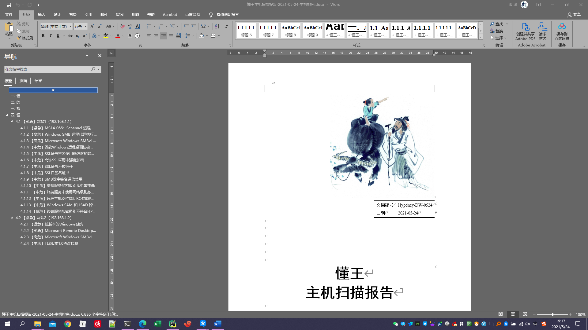

# NessusToReport

> Github地址:`https://github.com/Hypdncy/NessusToReport`

**不需要KEY也可以自动翻译、并且翻译后自动保存在本地数据库**

**不需要KEY也可以自动翻译、并且翻译后自动保存在本地数据库**

**不需要KEY也可以自动翻译、并且翻译后自动保存在本地数据库**

这是一个nessus自动报告生成工具，可以用来自动生成nessus扫描器的中文报告--NessusToReport，程序有两种报告方式：

- 漏洞排序：以漏洞为单位一一罗列拥有该漏洞的主机及其信息
- 主机排序：以主机为单位一一罗列主机所拥有的漏洞及其信息
- 单个主机：以主机为单位一一罗列每个主机的漏洞报告（一个主机一份报告）

## 使用说明

### 数据库

由于github LFS超额，数据库更新链接如下，感谢@MatriX925 的更新
链接: https://pan.baidu.com/s/1a4jcHCY8G-q65nmehlMTfw?pwd=gwtd 提取码: gwtd

#### 安装方法

建议在windows下安装python3.8+版本

> python3.6及其以下版本可能会出现字典错误

> python3.8及其以下版本可能会出现携程错误

```shell script
root@hypdncy:~# pip install -r requirement.txt
```
#### 使用方法

1. 导出nessus的csv，放置到`./data/nessus`目录下
2. 更新自己的实施范围`./data/systems.csv`
3. 更新自己的配置信息`./config.py`
4. 执行命令`python main.py`

```shell script
root@hypdncy:~# python main.py # 默认出漏洞排序类型扫描报告
root@hypdncy:~# python main.py -t loops # 指定漏洞排序类型扫描报告
root@hypdncy:~# python main.py -t hosts # 指定主机排序类型扫描报告
root@hypdncy:~# python main.py -t host  # 指定单个主机类型扫描报告
```

## 配置说明

本工具具有翻译功能，需要自己申请百度、有道翻译API的key，并将其配置到`./cnf/const.py`

> 百度API的Key最好进行个人高级认证，这样翻译的QPS为10，否则翻译时会造成KeyError的情况

> 有道翻译API是之前的代码未进行验证，欢迎有有道Key的同学push代码

> 其他翻译渠道需要在`./modle/common/translate/`添加翻译API的功能，并在`./modle/handle.py`中调用

#### 修改基本信息

该修改会修改模板中`{xxx-xxx}`标记的部分，程序运行时会将如下两个配置中的信息对其金星覆盖

1. 临时修改：修改`./config.py`中`config_data`
1. 永久修改：修改`./cnf/data.py`中`cnf_data`

#### 配置实施范围

- 配置说明：该配置将会替换文档中的`实施范围`表
- 直接修改`./data/systems.csv`

## 漏洞配置

记得使用完以下功能后将他们注释，防止下次生成报告时，使用该次的配置

#### 配置自定义IP限制

- 配置说明：该配置在生成报告时会限制与配置范围`IP`的所有漏洞信息，主要用于段扫描时限制主机范围
- 配置位置：config.py中`config.nessus_only_ips`参数

#### 配置自定义IP忽略

- 配置说明：该配置在生成报告时会忽略与配置相同`IP`的所有漏洞信息，主要用于段扫描时忽略本机漏洞
- 配置位置：config.py中`config.nessus_ignore_ips`参数

#### 配置自定义漏洞忽略

- 配置说明：该配置在生成报告时会忽略与配置相同`plugin_id`的漏洞，主要用于大量扫描时的批量删除
- 配置位置：config.py中`config.nessus_ignore_ids`参数

#### 配置自定义漏洞等级

- 该配置在生成报告时会修改与配置`plugin_id`的漏洞等级，主要用于调整漏洞等级`(鸡肋)`
- 配置位置：config.py中`config.nessus_risk_self`参数

#### 配置自定义漏洞信息

- 配置说明：该配置将会覆盖其他来源的漏洞信息，主要用于没有翻译API时，人工翻译`./logs/loops_error.json`，将其配置复制到该参数下
- 配置位置：config.py中`config.nessus_vuln_self`参数

## 更新说明

1. 项目不定期发布漏洞库vuln.db，在release中可以下载，并替换到./cnf/目录下
2. 各位可以将`./logs/loops_error.json`中的信息push到我的github，我将会翻译并将其更新其到数据库中
3. 在翻译漏洞后可以手动更新vuln.db，`cd ./modle/common/update && python updb.py`

## 演示图

>演示图漏洞排序


>演示图主机排序



Copyright (c) 2020 Hypdncy
